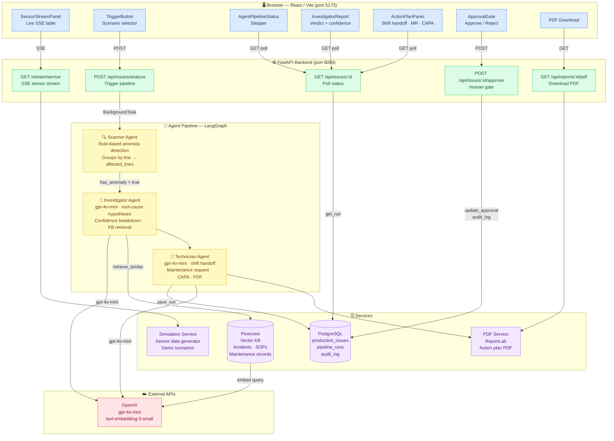

# System Architecture



## Component Summary

| Layer | Technology | Role |
|---|---|---|
| **Frontend** | React · Vite · Tailwind · shadcn/ui | SSE consumer, pipeline status, approval UI, PDF download |
| **Backend** | FastAPI · uvicorn | REST + SSE endpoints, background task orchestration |
| **Scanner Agent** | Python rule engine | Classifies sensor readings by rule, groups anomalies per line |
| **Investigator Agent** | gpt-4o-mini + Pinecone RAG | Root-cause hypotheses, confidence breakdown, recommendations |
| **Technician Agent** | gpt-4o-mini | Shift handoff note, maintenance request, CAPA, PDF trigger |
| **PostgreSQL** | asyncpg · 9 tables | Pipeline state, audit log, approval workflow |
| **Pinecone** | Vector search | Historical incidents, SOPs, maintenance records |
| **PDF Service** | ReportLab | Branded corrective action plan PDF |
| **OpenAI** | gpt-4o-mini + embeddings | LLM inference and vector embeddings |

## Data Flow

```
Sensor SSE stream
    └─▶ Frontend displays live readings
            └─▶ Plant manager clicks Analyze
                    └─▶ POST /api/issues/analyze  (returns issue_id immediately)
                            └─▶ Background: Scanner → Investigator → Technician
                                    └─▶ GET /api/issues/:id  (frontend polls)
                                            └─▶ Plant manager reviews + Approves
                                                    └─▶ POST /api/issues/:id/approve
                                                            └─▶ Audit log written
                                                                    └─▶ GET /api/reports/:id/pdf
```
